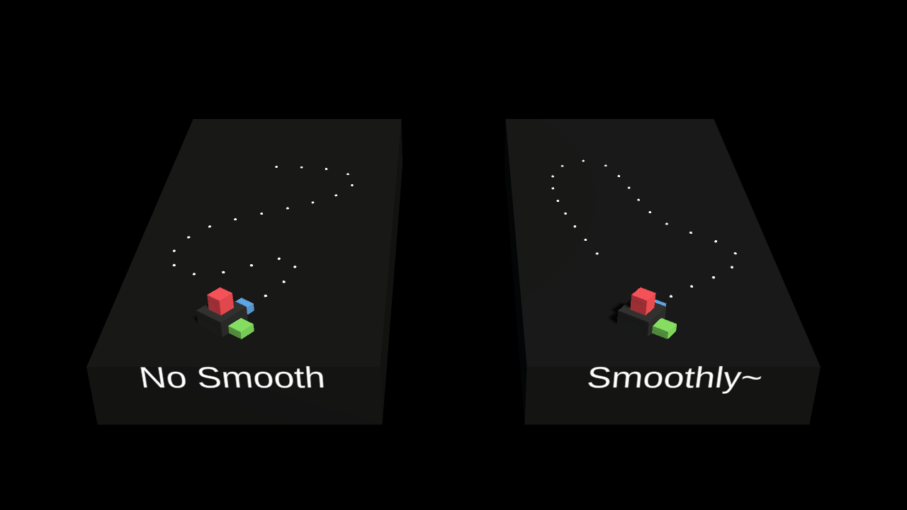
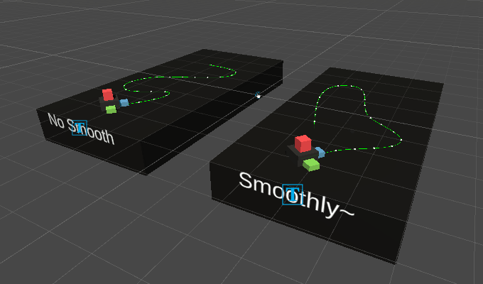
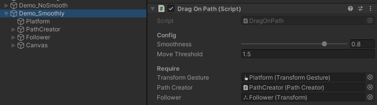

# TechDemo_DragObjectAlongPath
Implement "drag object along path" behaviour with Unity plugin: TouchScript &amp; BézierPathCreator

## Using plugins
- [Touch Script](https://assetstore.unity.com/packages/tools/input-management/touchscript-7394)：  
trace multi-touich input
- [Bézier Path Creator](https://assetstore.unity.com/packages/tools/utilities/b-zier-path-creator-136082)：  
create curve track path

## Demo

